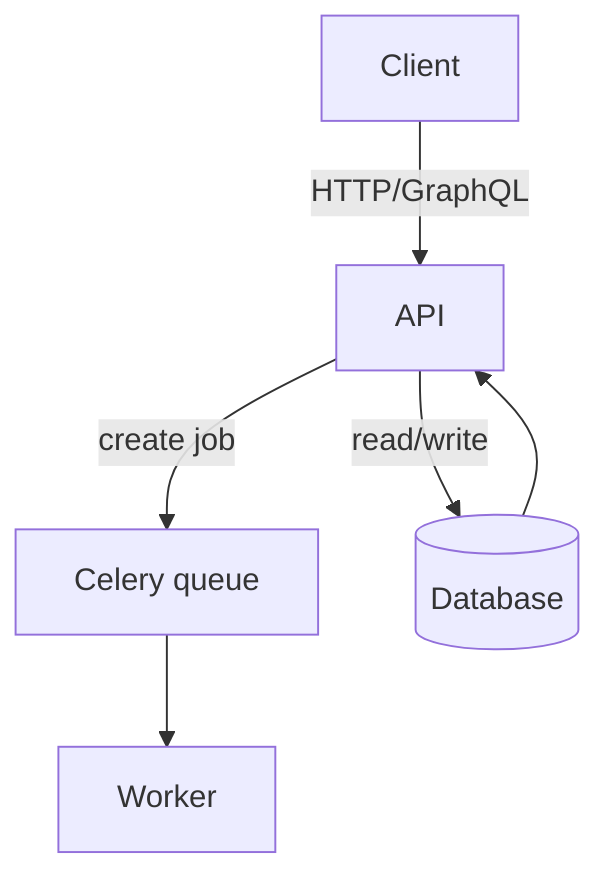
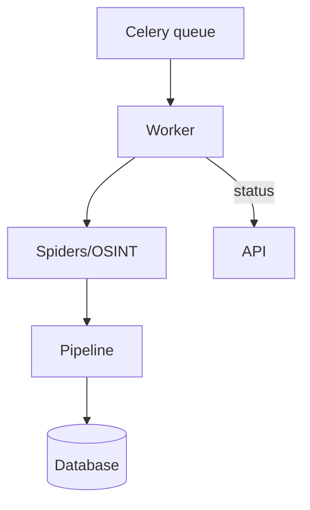
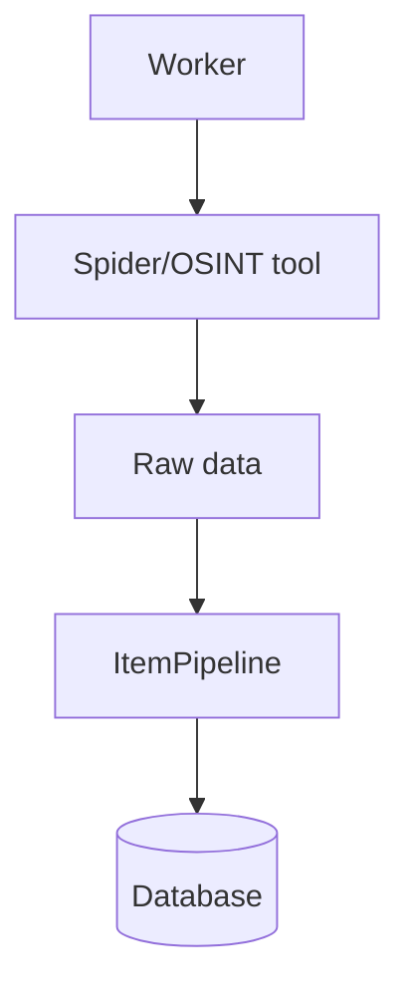
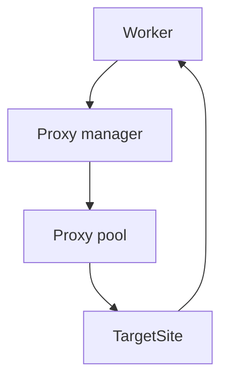
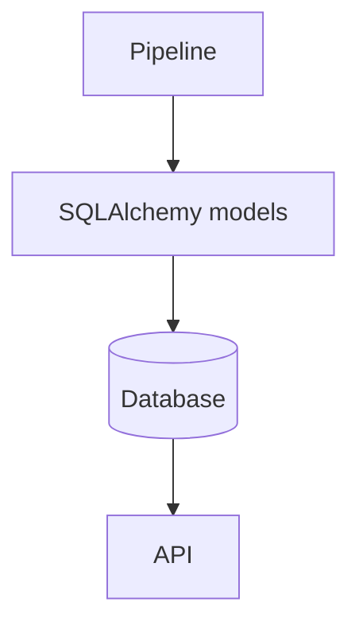
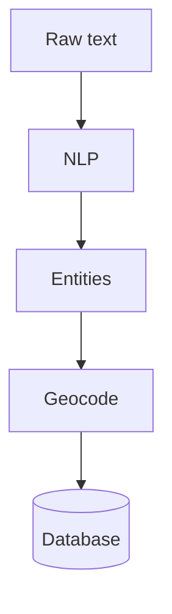
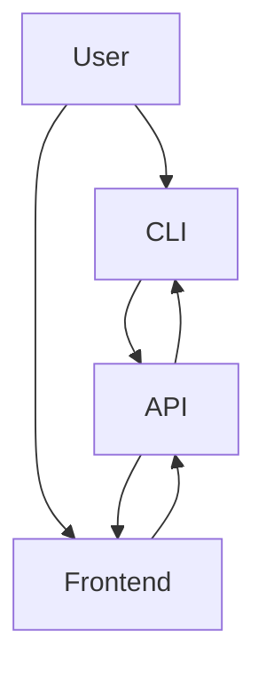
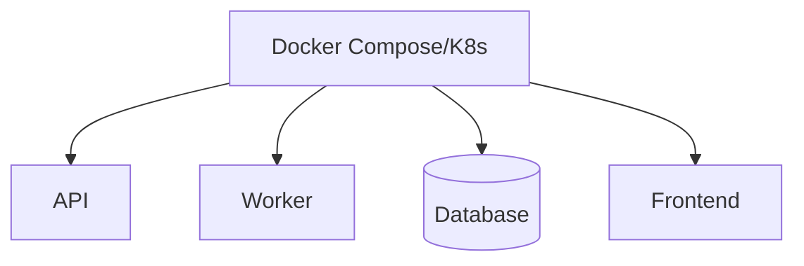
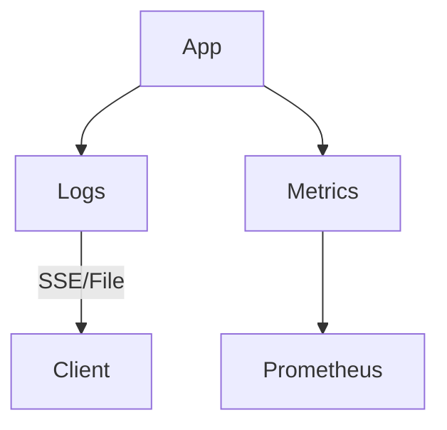

# Architecture

This document outlines the structure of the Business Intelligence Scraper project and how its pieces fit together. The
diagrams below use the [Mermaid](https://mermaid-js.github.io/) syntax which is
rendered automatically on most Git hosting platforms.

## Overview

The repository is organised as a Python package called `business_intel_scraper`.  A FastAPI service exposes HTTP and GraphQL endpoints while Celery workers execute long running scraping and OSINT tasks.  An optional React frontend provides a small dashboard.  Infrastructure scripts allow the stack to run either via Docker Compose or Kubernetes.

## Components

### API service
- Location: `business_intel_scraper/backend/api`
- Provides REST and GraphQL endpoints
- WebSocket notifications and Server-Sent Events for log streaming
- Middleware for security headers, rate limiting and Prometheus metrics
- JWT authentication



### Worker processes
- Location: `business_intel_scraper/backend/workers`
- Celery tasks for spiders, OSINT integrations and NLP/geo processing
- Periodic jobs defined in `celery_app.conf.beat_schedule`
- Falls back to an in-process executor when Celery is not installed



### Scrapers and OSINT modules
- Example Scrapy spider under `backend/modules/crawlers`
- External tools wrapped in `backend/integrations`



### Proxy management
- Pluggable proxy rotation utilities in `backend/proxy`



### Database layer
- SQLAlchemy models and Alembic migrations in `backend/db`
- Helper pipeline to persist scraped items



### NLP and geocoding
- Text cleaning and entity extraction in `backend/nlp`
- Address geocoding helpers in `backend/geo`



### CLI and frontend
- `business_intel_scraper/cli.py` provides basic command line access
- `frontend/` contains a minimal JavaScript UI



### Infrastructure
- Docker Compose and Dockerfiles under `infra/docker`
- Kubernetes manifests in `infra/k8s`
- Monitoring examples in `infra/monitoring`



### Logging and metrics
- Logs written to `backend/logs/app.log`
- Prometheus metrics served by the API at `/metrics`



## Directory layout

```text
business_intel_scraper/
├── backend/                 # API, workers and core modules
├── frontend/                # Optional dashboard
├── infra/                   # Docker and Kubernetes configuration
└── docs/                    # Project documentation
```

## Data flow

1. A request to `/scrape` or the CLI queues a task via Celery.
2. A worker runs the spider or OSINT tool and stores results.
3. Progress is exposed through `/tasks/{id}` and broadcast on the WebSocket.
4. Processed data can be exported or further analysed via the API or CLI.

See the root `README.md` for running instructions and `docs/workflow.md` for a walk-through of the typical developer workflow.
