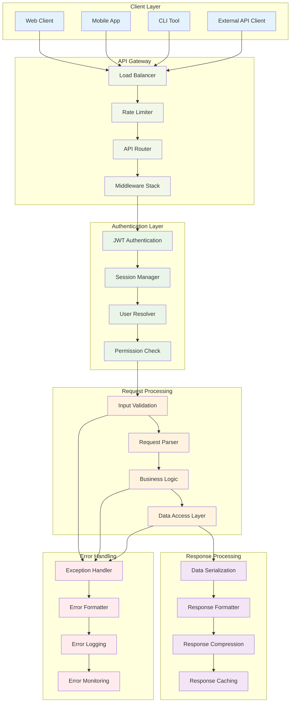
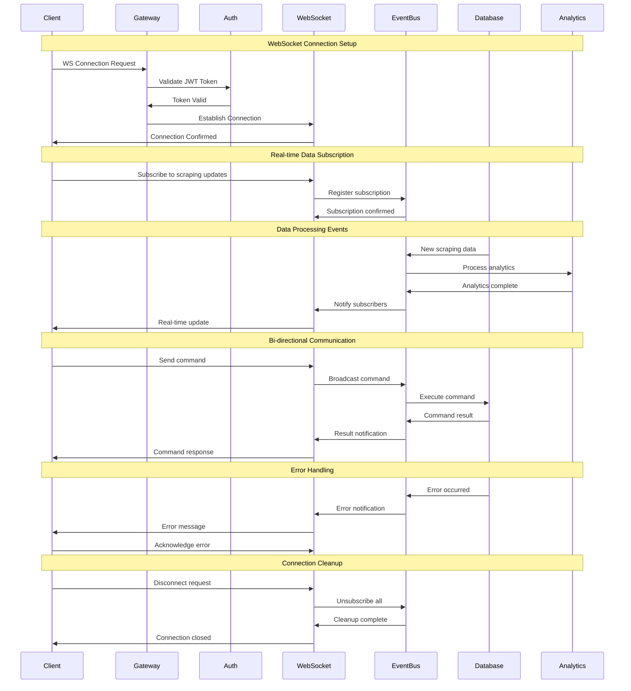
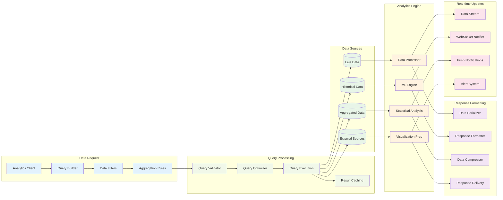
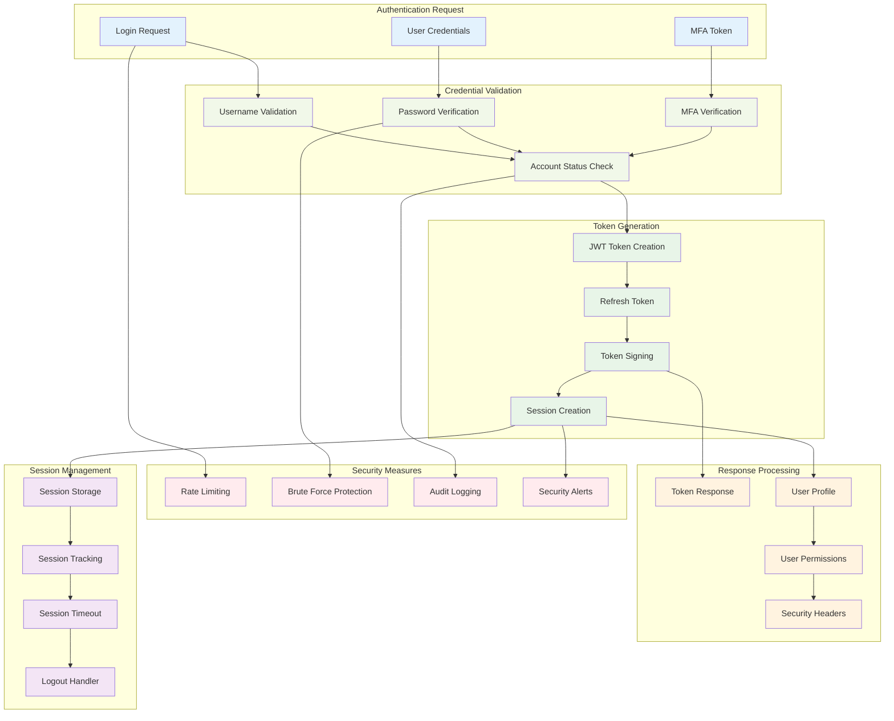
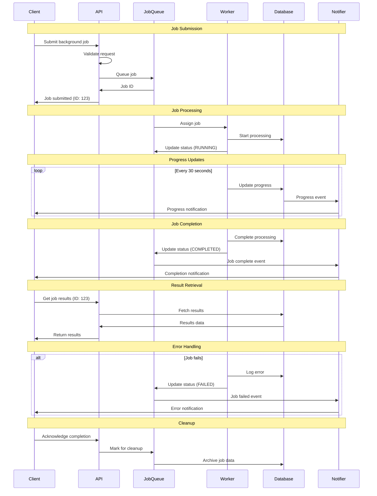

# API Flow Diagrams

## 🌐 REST API Flow Architecture



## 🔄 WebSocket Real-time Flow



## 📊 Analytics API Flow



## 🕷️ Scraping API Workflow

```mermaid
stateDiagram-v2
    [*] --> RequestReceived
    
    state "Scraping Request Processing" {
        RequestReceived --> ValidationCheck
        ValidationCheck --> AuthenticationCheck
        AuthenticationCheck --> RateLimitCheck
        RateLimitCheck --> JobCreation
    }
    
    state "Job Management" {
        JobCreation --> JobQueued
        JobQueued --> JobScheduled
        JobScheduled --> JobExecuting
        JobExecuting --> JobMonitoring
    }
    
    state "Scraping Execution" {
        JobMonitoring --> CrawlerInitialized
        CrawlerInitialized --> URLDiscovery
        URLDiscovery --> ContentExtraction
        ContentExtraction --> DataProcessing
    }
    
    state "Data Processing" {
        DataProcessing --> DataValidation
        DataValidation --> DataCleaning
        DataCleaning --> DataEnrichment
        DataEnrichment --> DataStorage
    }
    
    state "Job Completion" {
        DataStorage --> ResultsGeneration
        ResultsGeneration --> NotificationSent
        NotificationSent --> JobCompleted
        JobCompleted --> [*]
    }
    
    state "Error Handling" {
        ValidationCheck --> ValidationError
        AuthenticationCheck --> AuthError
        RateLimitCheck --> RateLimitError
        JobExecuting --> ExecutionError
        DataProcessing --> ProcessingError
        
        ValidationError --> ErrorResponse
        AuthError --> ErrorResponse
        RateLimitError --> ErrorResponse
        ExecutionError --> JobFailed
        ProcessingError --> JobFailed
        
        JobFailed --> ErrorNotification
        ErrorNotification --> [*]
        ErrorResponse --> [*]
    }
    
    state "Progress Updates" {
        JobMonitoring --> ProgressUpdate
        URLDiscovery --> ProgressUpdate
        ContentExtraction --> ProgressUpdate
        DataProcessing --> ProgressUpdate
        
        ProgressUpdate --> WebSocketNotification
        WebSocketNotification --> ClientUpdate
    }
```

## 🔐 Authentication API Flow



## 📊 Data Export API Flow

```mermaid
graph LR
    subgraph "Export Request"
        CLIENT_REQUEST[Client Request]
        FORMAT_SELECTION[Format Selection]
        FILTER_CRITERIA[Filter Criteria]
        DATE_RANGE[Date Range]
    end
    
    subgraph "Request Processing"
        VALIDATION[Request Validation]
        AUTHORIZATION[Authorization Check]
        QUOTA_CHECK[Quota Verification]
        JOB_CREATION[Export Job Creation]
    end
    
    subgraph "Data Preparation"
        QUERY_BUILDER[Query Builder]
        DATA_RETRIEVAL[Data Retrieval]
        DATA_FILTERING[Data Filtering]
        DATA_TRANSFORMATION[Data Transformation]
    end
    
    subgraph "Format Processing"
        CSV_FORMATTER[CSV Formatter]
        JSON_FORMATTER[JSON Formatter]
        XML_FORMATTER[XML Formatter]
        EXCEL_FORMATTER[Excel Formatter]
    end
    
    subgraph "File Generation"
        FILE_CREATION[File Creation]
        COMPRESSION[File Compression]
        ENCRYPTION[File Encryption]
        STORAGE[Temporary Storage]
    end
    
    subgraph "Delivery Options"
        DIRECT_DOWNLOAD[Direct Download]
        EMAIL_DELIVERY[Email Delivery]
        API_RESPONSE[API Response]
        WEBHOOK_NOTIFICATION[Webhook Notification]
    end
    
    %% Flow connections
    CLIENT_REQUEST --> VALIDATION
    FORMAT_SELECTION --> AUTHORIZATION
    FILTER_CRITERIA --> QUOTA_CHECK
    DATE_RANGE --> JOB_CREATION
    
    VALIDATION --> QUERY_BUILDER
    AUTHORIZATION --> DATA_RETRIEVAL
    QUOTA_CHECK --> DATA_FILTERING
    JOB_CREATION --> DATA_TRANSFORMATION
    
    DATA_RETRIEVAL --> CSV_FORMATTER
    DATA_FILTERING --> JSON_FORMATTER
    DATA_TRANSFORMATION --> XML_FORMATTER
    QUERY_BUILDER --> EXCEL_FORMATTER
    
    CSV_FORMATTER --> FILE_CREATION
    JSON_FORMATTER --> COMPRESSION
    XML_FORMATTER --> ENCRYPTION
    EXCEL_FORMATTER --> STORAGE
    
    FILE_CREATION --> DIRECT_DOWNLOAD
    COMPRESSION --> EMAIL_DELIVERY
    ENCRYPTION --> API_RESPONSE
    STORAGE --> WEBHOOK_NOTIFICATION
    
    %% Styling
    classDef request fill:#e3f2fd
    classDef processing fill:#f1f8e9
    classDef preparation fill:#e8f5e8
    classDef formatting fill:#fff3e0
    classDef generation fill:#f3e5f5
    classDef delivery fill:#fce4ec
    
    class CLIENT_REQUEST,FORMAT_SELECTION,FILTER_CRITERIA,DATE_RANGE request
    class VALIDATION,AUTHORIZATION,QUOTA_CHECK,JOB_CREATION processing
    class QUERY_BUILDER,DATA_RETRIEVAL,DATA_FILTERING,DATA_TRANSFORMATION preparation
    class CSV_FORMATTER,JSON_FORMATTER,XML_FORMATTER,EXCEL_FORMATTER formatting
    class FILE_CREATION,COMPRESSION,ENCRYPTION,STORAGE generation
    class DIRECT_DOWNLOAD,EMAIL_DELIVERY,API_RESPONSE,WEBHOOK_NOTIFICATION delivery
```



## 🔄 Background Job API Flow


