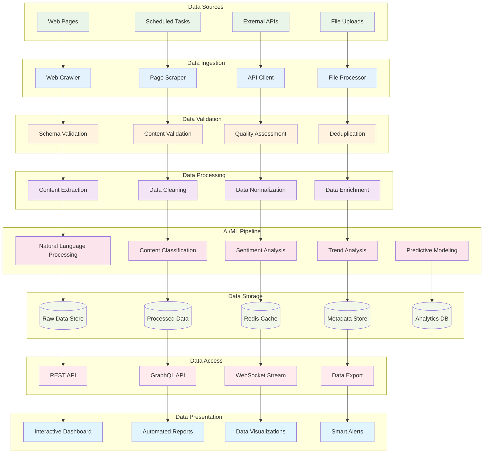
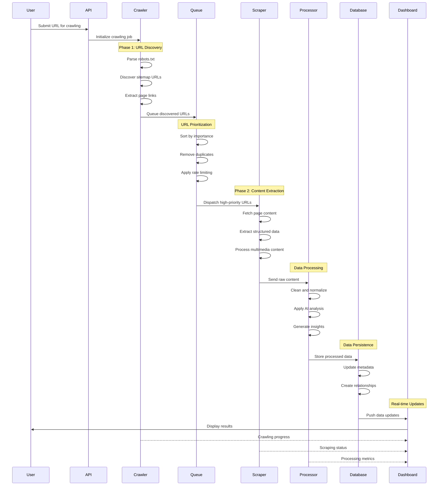
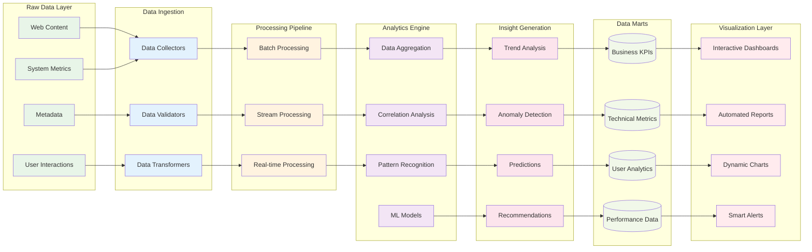
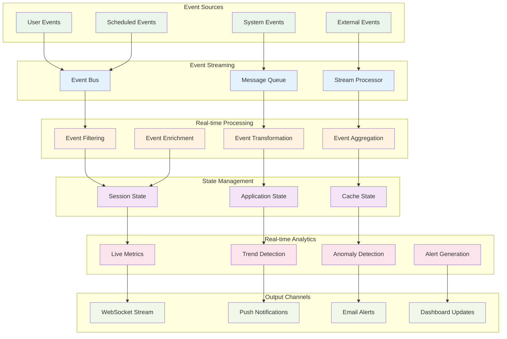
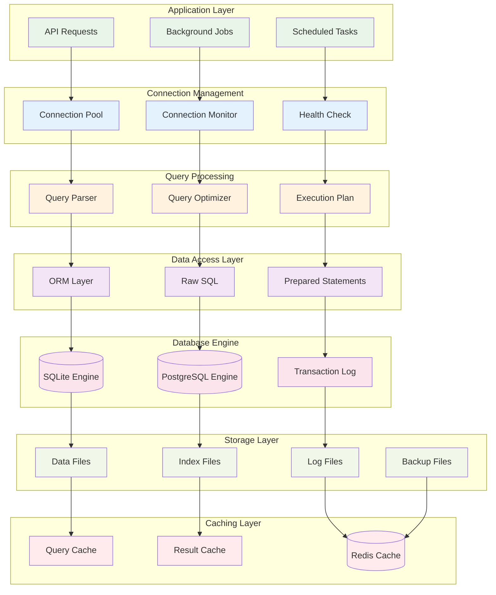
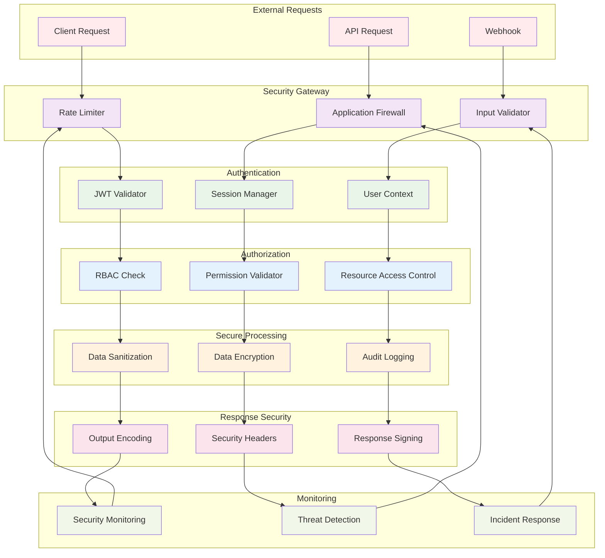

# Data Flow Diagrams

## 🌊 Complete Data Flow Pipeline

## 🕷️ Crawler-to-Scraper Data Flow

## 📊 Analytics Data Pipeline

## 🔄 Real-time Data Processing

## 🗄️ Database Data Flow

## 🔐 Security Data Flow

