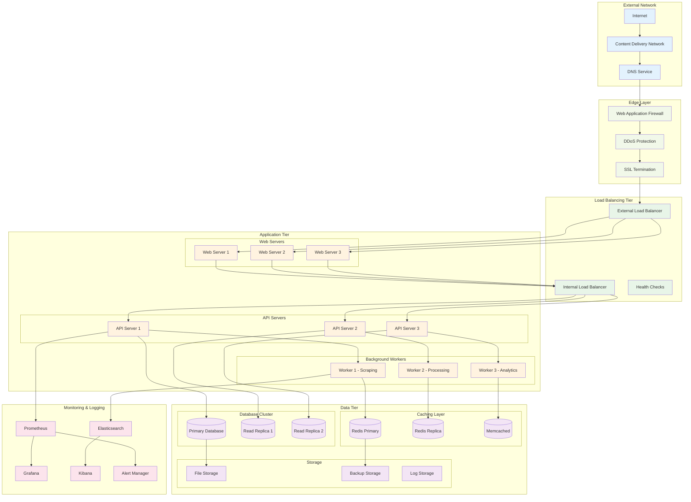
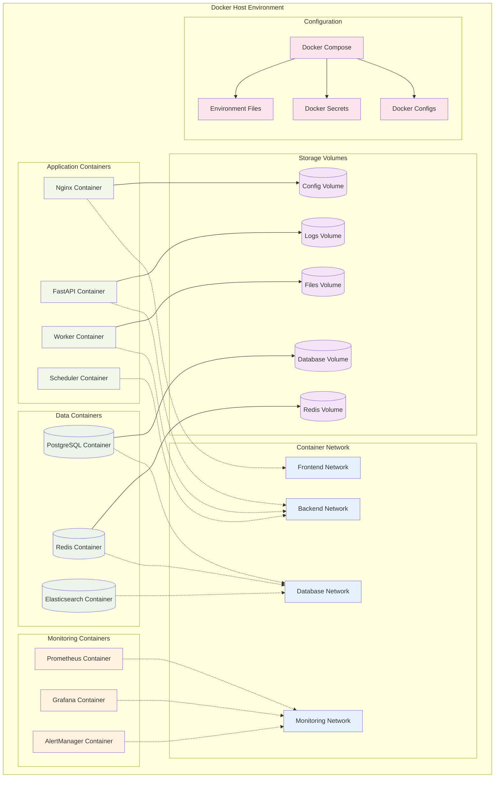
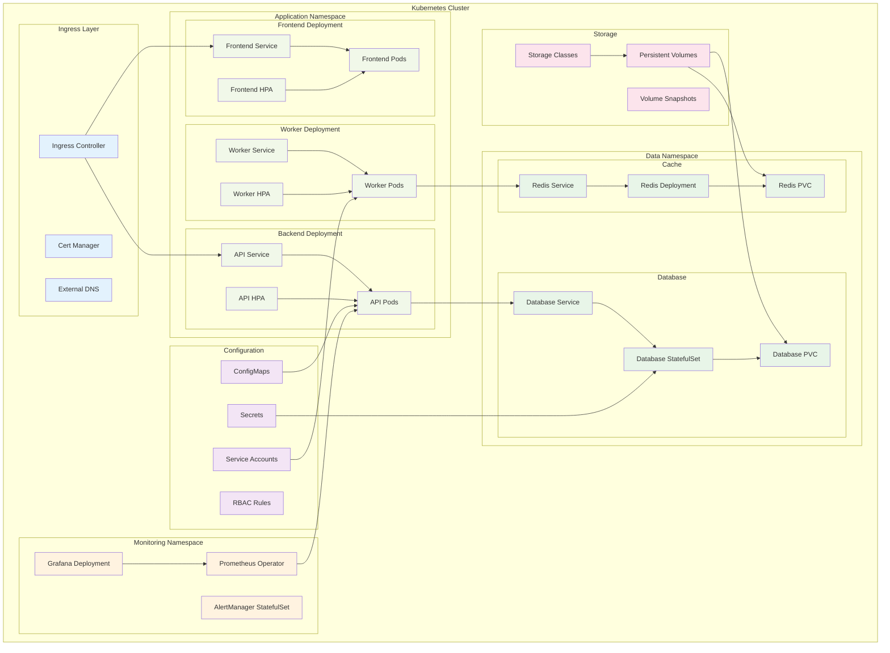
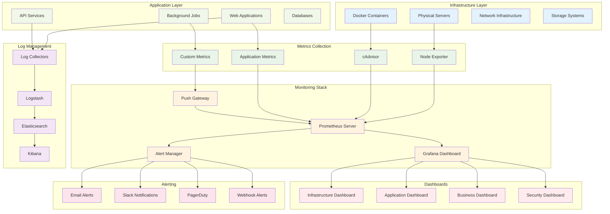

# Deployment Diagrams

## 🚀 Production Deployment Architecture

## 🐳 Docker Container Architecture

## ☸️ Kubernetes Deployment

## 🌊 CI/CD Pipeline Deployment

```mermaid
graph LR
    subgraph "Source Control"
        GIT_REPO[Git Repository]
        FEATURE_BRANCH[Feature Branch]
        MAIN_BRANCH[Main Branch]
        RELEASE_TAG[Release Tag]
    end
    
    subgraph "CI Pipeline"
        TRIGGER[Webhook Trigger]
        CHECKOUT[Code Checkout]
        BUILD[Build & Test]
        SECURITY_SCAN[Security Scan]
        DOCKER_BUILD[Docker Build]
        REGISTRY_PUSH[Registry Push]
    end
    
    subgraph "CD Pipeline"
        DEPLOY_TRIGGER[Deploy Trigger]
        ENV_VALIDATION[Environment Validation]
        DATABASE_MIGRATION[Database Migration]
        DEPLOYMENT[Application Deployment]
        HEALTH_CHECK[Health Verification]
        ROLLBACK[Rollback on Failure]
    end
    
    subgraph "Environments"
        DEV_ENV[Development]
        STAGING_ENV[Staging]
        PROD_ENV[Production]
    end
    
    subgraph "Monitoring"
        DEPLOYMENT_METRICS[Deployment Metrics]
        APPLICATION_MONITORING[App Monitoring]
        ALERT_SYSTEM[Alert System]
    end
    
    %% CI Flow
    FEATURE_BRANCH --> TRIGGER
    MAIN_BRANCH --> TRIGGER
    RELEASE_TAG --> TRIGGER
    
    TRIGGER --> CHECKOUT
    CHECKOUT --> BUILD
    BUILD --> SECURITY_SCAN
    SECURITY_SCAN --> DOCKER_BUILD
    DOCKER_BUILD --> REGISTRY_PUSH
    
    %% CD Flow
    REGISTRY_PUSH --> DEPLOY_TRIGGER
    DEPLOY_TRIGGER --> ENV_VALIDATION
    ENV_VALIDATION --> DATABASE_MIGRATION
    DATABASE_MIGRATION --> DEPLOYMENT
    DEPLOYMENT --> HEALTH_CHECK
    HEALTH_CHECK --> ROLLBACK
    
    %% Environment Flow
    DEPLOYMENT --> DEV_ENV
    DEPLOYMENT --> STAGING_ENV
    DEPLOYMENT --> PROD_ENV
    
    %% Monitoring Flow
    DEPLOYMENT --> DEPLOYMENT_METRICS
    HEALTH_CHECK --> APPLICATION_MONITORING
    APPLICATION_MONITORING --> ALERT_SYSTEM
    
    %% Styling
    classDef source fill:#e3f2fd
    classDef ci fill:#f1f8e9
    classDef cd fill:#e8f5e8
    classDef environments fill:#fff3e0
    classDef monitoring fill:#f3e5f5
    
    class GIT_REPO,FEATURE_BRANCH,MAIN_BRANCH,RELEASE_TAG source
    class TRIGGER,CHECKOUT,BUILD,SECURITY_SCAN,DOCKER_BUILD,REGISTRY_PUSH ci
    class DEPLOY_TRIGGER,ENV_VALIDATION,DATABASE_MIGRATION,DEPLOYMENT,HEALTH_CHECK,ROLLBACK cd
    class DEV_ENV,STAGING_ENV,PROD_ENV environments
    class DEPLOYMENT_METRICS,APPLICATION_MONITORING,ALERT_SYSTEM monitoring
```

## 📊 Infrastructure Monitoring

## 🔒 Security Deployment Architecture

```mermaid
graph TB
    subgraph "Perimeter Security"
        EXTERNAL_FIREWALL[External Firewall]
        DDOS_PROTECTION[DDoS Protection]
        WAF[Web Application Firewall]
        INTRUSION_DETECTION[Intrusion Detection]
    end
    
    subgraph "Network Security"
        VPN_GATEWAY[VPN Gateway]
        INTERNAL_FIREWALL[Internal Firewall]
        NETWORK_SEGMENTATION[Network Segmentation]
        TRAFFIC_INSPECTION[Traffic Inspection]
    end
    
    subgraph "Application Security"
        API_GATEWAY[API Gateway]
        AUTHENTICATION[Authentication Service]
        AUTHORIZATION[Authorization Service]
        INPUT_VALIDATION[Input Validation]
    end
    
    subgraph "Data Security"
        ENCRYPTION_SERVICE[Encryption Service]
        KEY_MANAGEMENT[Key Management]
        DATABASE_SECURITY[Database Security]
        BACKUP_ENCRYPTION[Backup Encryption]
    end
    
    subgraph "Monitoring & Compliance"
        SECURITY_MONITORING[Security Monitoring]
        AUDIT_LOGGING[Audit Logging]
        COMPLIANCE_REPORTING[Compliance Reporting]
        VULNERABILITY_SCANNING[Vulnerability Scanning]
    end
    
    subgraph "Incident Response"
        INCIDENT_DETECTION[Incident Detection]
        AUTOMATED_RESPONSE[Automated Response]
        FORENSICS[Digital Forensics]
        RECOVERY_PROCEDURES[Recovery Procedures]
    end
    
    %% Security flow
    EXTERNAL_FIREWALL --> DDOS_PROTECTION
    DDOS_PROTECTION --> WAF
    WAF --> INTRUSION_DETECTION
    
    INTRUSION_DETECTION --> VPN_GATEWAY
    VPN_GATEWAY --> INTERNAL_FIREWALL
    INTERNAL_FIREWALL --> NETWORK_SEGMENTATION
    NETWORK_SEGMENTATION --> TRAFFIC_INSPECTION
    
    TRAFFIC_INSPECTION --> API_GATEWAY
    API_GATEWAY --> AUTHENTICATION
    AUTHENTICATION --> AUTHORIZATION
    AUTHORIZATION --> INPUT_VALIDATION
    
    INPUT_VALIDATION --> ENCRYPTION_SERVICE
    ENCRYPTION_SERVICE --> KEY_MANAGEMENT
    KEY_MANAGEMENT --> DATABASE_SECURITY
    DATABASE_SECURITY --> BACKUP_ENCRYPTION
    
    BACKUP_ENCRYPTION --> SECURITY_MONITORING
    SECURITY_MONITORING --> AUDIT_LOGGING
    AUDIT_LOGGING --> COMPLIANCE_REPORTING
    COMPLIANCE_REPORTING --> VULNERABILITY_SCANNING
    
    VULNERABILITY_SCANNING --> INCIDENT_DETECTION
    INCIDENT_DETECTION --> AUTOMATED_RESPONSE
    AUTOMATED_RESPONSE --> FORENSICS
    FORENSICS --> RECOVERY_PROCEDURES
    
    %% Monitoring feedback loops
    SECURITY_MONITORING --> EXTERNAL_FIREWALL
    INCIDENT_DETECTION --> WAF
    AUTOMATED_RESPONSE --> INTERNAL_FIREWALL
    
    %% Styling
    classDef perimeter fill:#ffebee
    classDef network fill:#f3e5f5
    classDef application fill:#e8f5e8
    classDef data fill:#e3f2fd
    classDef monitoring fill:#fff3e0
    classDef incident fill:#fce4ec
    
    class EXTERNAL_FIREWALL,DDOS_PROTECTION,WAF,INTRUSION_DETECTION perimeter
    class VPN_GATEWAY,INTERNAL_FIREWALL,NETWORK_SEGMENTATION,TRAFFIC_INSPECTION network
    class API_GATEWAY,AUTHENTICATION,AUTHORIZATION,INPUT_VALIDATION application
    class ENCRYPTION_SERVICE,KEY_MANAGEMENT,DATABASE_SECURITY,BACKUP_ENCRYPTION data
    class SECURITY_MONITORING,AUDIT_LOGGING,COMPLIANCE_REPORTING,VULNERABILITY_SCANNING monitoring
    class INCIDENT_DETECTION,AUTOMATED_RESPONSE,FORENSICS,RECOVERY_PROCEDURES incident
```

