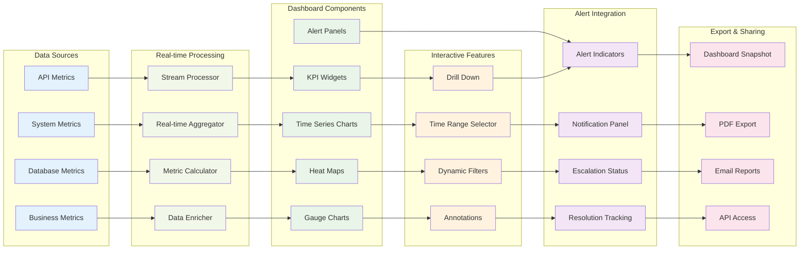
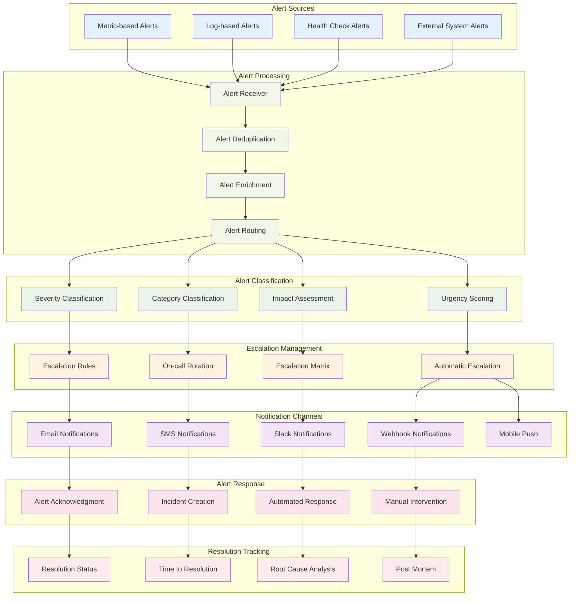
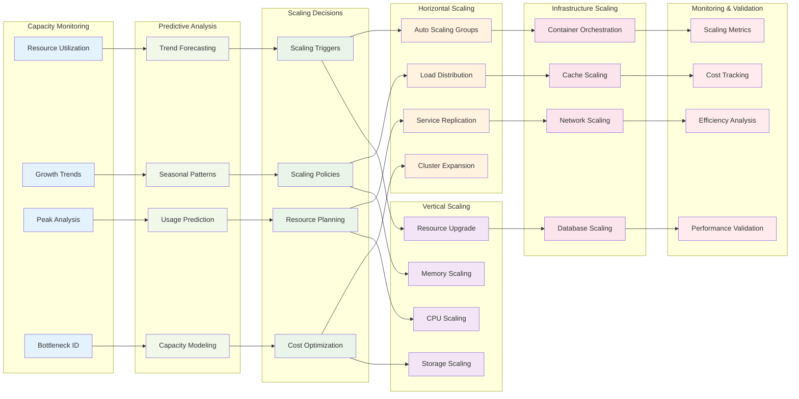

# Performance & Monitoring Diagrams

## 📊 Performance Monitoring Architecture

```mermaid
graph TB
    subgraph "Application Performance"
        API_LATENCY[API Response Times]
        THROUGHPUT[Request Throughput]
        ERROR_RATES[Error Rates]
        CONCURRENT_USERS[Concurrent Users]
    end
    
    subgraph "System Performance"
        CPU_USAGE[CPU Usage]
        MEMORY_USAGE[Memory Usage]
        DISK_IO[Disk I/O]
        NETWORK_IO[Network I/O]
    end
    
    subgraph "Database Performance"
        QUERY_PERFORMANCE[Query Performance]
        CONNECTION_POOL[Connection Pool]
        CACHE_HITS[Cache Hit Ratio]
        LOCK_CONTENTION[Lock Contention]
    end
    
    subgraph "Metrics Collection"
        PROMETHEUS[Prometheus Server]
        NODE_EXPORTER[Node Exporter]
        APPLICATION_METRICS[App Metrics]
        DATABASE_EXPORTER[DB Exporter]
    end
    
    subgraph "Alerting System"
        THRESHOLD_ALERTS[Threshold Alerts]
        ANOMALY_DETECTION[Anomaly Detection]
        PREDICTIVE_ALERTS[Predictive Alerts]
        ESCALATION_RULES[Escalation Rules]
    end
    
    subgraph "Visualization"
        GRAFANA_DASHBOARDS[Grafana Dashboards]
        REAL_TIME_CHARTS[Real-time Charts]
        HISTORICAL_TRENDS[Historical Trends]
        PERFORMANCE_REPORTS[Performance Reports]
    end
    
    subgraph "Performance Optimization"
        AUTO_SCALING[Auto Scaling]
        LOAD_BALANCING[Load Balancing]
        CACHE_OPTIMIZATION[Cache Optimization]
        QUERY_OPTIMIZATION[Query Optimization]
    end
    
    %% Performance flow
    API_LATENCY --> APPLICATION_METRICS
    THROUGHPUT --> APPLICATION_METRICS
    ERROR_RATES --> APPLICATION_METRICS
    CONCURRENT_USERS --> APPLICATION_METRICS
    
    CPU_USAGE --> NODE_EXPORTER
    MEMORY_USAGE --> NODE_EXPORTER
    DISK_IO --> NODE_EXPORTER
    NETWORK_IO --> NODE_EXPORTER
    
    QUERY_PERFORMANCE --> DATABASE_EXPORTER
    CONNECTION_POOL --> DATABASE_EXPORTER
    CACHE_HITS --> DATABASE_EXPORTER
    LOCK_CONTENTION --> DATABASE_EXPORTER
    
    APPLICATION_METRICS --> PROMETHEUS
    NODE_EXPORTER --> PROMETHEUS
    DATABASE_EXPORTER --> PROMETHEUS
    
    PROMETHEUS --> THRESHOLD_ALERTS
    PROMETHEUS --> ANOMALY_DETECTION
    PROMETHEUS --> PREDICTIVE_ALERTS
    
    THRESHOLD_ALERTS --> ESCALATION_RULES
    ANOMALY_DETECTION --> ESCALATION_RULES
    PREDICTIVE_ALERTS --> ESCALATION_RULES
    
    PROMETHEUS --> GRAFANA_DASHBOARDS
    GRAFANA_DASHBOARDS --> REAL_TIME_CHARTS
    GRAFANA_DASHBOARDS --> HISTORICAL_TRENDS
    GRAFANA_DASHBOARDS --> PERFORMANCE_REPORTS
    
    THRESHOLD_ALERTS --> AUTO_SCALING
    ANOMALY_DETECTION --> LOAD_BALANCING
    PREDICTIVE_ALERTS --> CACHE_OPTIMIZATION
    ESCALATION_RULES --> QUERY_OPTIMIZATION
    
    %% Styling
    classDef application fill:#e3f2fd
    classDef system fill:#f1f8e9
    classDef database fill:#e8f5e8
    classDef collection fill:#fff3e0
    classDef alerting fill:#f3e5f5
    classDef visualization fill:#fce4ec
    classDef optimization fill:#ffebee
    
    class API_LATENCY,THROUGHPUT,ERROR_RATES,CONCURRENT_USERS application
    class CPU_USAGE,MEMORY_USAGE,DISK_IO,NETWORK_IO system
    class QUERY_PERFORMANCE,CONNECTION_POOL,CACHE_HITS,LOCK_CONTENTION database
    class PROMETHEUS,NODE_EXPORTER,APPLICATION_METRICS,DATABASE_EXPORTER collection
    class THRESHOLD_ALERTS,ANOMALY_DETECTION,PREDICTIVE_ALERTS,ESCALATION_RULES alerting
    class GRAFANA_DASHBOARDS,REAL_TIME_CHARTS,HISTORICAL_TRENDS,PERFORMANCE_REPORTS visualization
    class AUTO_SCALING,LOAD_BALANCING,CACHE_OPTIMIZATION,QUERY_OPTIMIZATION optimization
```



## 🎯 Real-time Performance Dashboard



## 🔍 System Health Monitoring

```mermaid
stateDiagram-v2
    [*] --> SystemHealthy
    
    state "System Monitoring" {
        SystemHealthy --> PerformanceCheck
        PerformanceCheck --> ResourceCheck
        ResourceCheck --> ServiceCheck
        ServiceCheck --> SecurityCheck
        SecurityCheck --> SystemHealthy
    }
    
    state "Performance Issues" {
        PerformanceCheck --> HighLatency
        PerformanceCheck --> LowThroughput
        PerformanceCheck --> HighErrorRate
        
        HighLatency --> AutoScaling
        LowThroughput --> LoadBalancing
        HighErrorRate --> ErrorAnalysis
        
        AutoScaling --> SystemHealthy
        LoadBalancing --> SystemHealthy
        ErrorAnalysis --> SystemHealthy
    }
    
    state "Resource Issues" {
        ResourceCheck --> HighCPU
        ResourceCheck --> HighMemory
        ResourceCheck --> DiskSpace
        ResourceCheck --> NetworkCongestion
        
        HighCPU --> ResourceOptimization
        HighMemory --> MemoryCleanup
        DiskSpace --> DiskCleanup
        NetworkCongestion --> TrafficShaping
        
        ResourceOptimization --> SystemHealthy
        MemoryCleanup --> SystemHealthy
        DiskCleanup --> SystemHealthy
        TrafficShaping --> SystemHealthy
    }
    
    state "Service Issues" {
        ServiceCheck --> ServiceDown
        ServiceCheck --> DatabaseIssue
        ServiceCheck --> CacheIssue
        ServiceCheck --> QueueIssue
        
        ServiceDown --> ServiceRestart
        DatabaseIssue --> DatabaseRecovery
        CacheIssue --> CacheReset
        QueueIssue --> QueueClear
        
        ServiceRestart --> SystemHealthy
        DatabaseRecovery --> SystemHealthy
        CacheReset --> SystemHealthy
        QueueClear --> SystemHealthy
    }
    
    state "Security Issues" {
        SecurityCheck --> SecurityThreat
        SecurityCheck --> UnauthorizedAccess
        SecurityCheck --> DataBreach
        
        SecurityThreat --> ThreatMitigation
        UnauthorizedAccess --> AccessRevocation
        DataBreach --> IncidentResponse
        
        ThreatMitigation --> SystemHealthy
        AccessRevocation --> SystemHealthy
        IncidentResponse --> SystemRecovery
        SystemRecovery --> SystemHealthy
    }
    
    state "Critical Failure" {
        ServiceDown --> CriticalFailure
        DatabaseIssue --> CriticalFailure
        SecurityThreat --> CriticalFailure
        
        CriticalFailure --> DisasterRecovery
        DisasterRecovery --> SystemRecovery
    }
```

## 📈 Performance Benchmarking

```mermaid
graph TB
    subgraph "Benchmark Categories"
        API_BENCHMARKS[API Performance]
        DATABASE_BENCHMARKS[Database Performance]
        SCRAPING_BENCHMARKS[Scraping Performance]
        SYSTEM_BENCHMARKS[System Performance]
    end
    
    subgraph "API Performance Tests"
        LATENCY_TEST[Latency Tests]
        THROUGHPUT_TEST[Throughput Tests]
        CONCURRENT_TEST[Concurrent User Tests]
        STRESS_TEST[Stress Tests]
    end
    
    subgraph "Database Performance Tests"
        QUERY_BENCHMARK[Query Benchmarks]
        CONNECTION_BENCHMARK[Connection Pool Tests]
        TRANSACTION_BENCHMARK[Transaction Tests]
        REPLICATION_BENCHMARK[Replication Tests]
    end
    
    subgraph "Scraping Performance Tests"
        CRAWL_SPEED[Crawl Speed Tests]
        EXTRACTION_SPEED[Extraction Speed]
        PARALLEL_PROCESSING[Parallel Processing]
        RESOURCE_USAGE[Resource Usage Tests]
    end
    
    subgraph "Benchmark Execution"
        TEST_RUNNER[Test Runner]
        LOAD_GENERATOR[Load Generator]
        METRIC_COLLECTOR[Metric Collector]
        RESULT_ANALYZER[Result Analyzer]
    end
    
    subgraph "Performance Baselines"
        BASELINE_METRICS[Baseline Metrics]
        PERFORMANCE_TARGETS[Performance Targets]
        SLA_THRESHOLDS[SLA Thresholds]
        REGRESSION_DETECTION[Regression Detection]
    end
    
    subgraph "Reporting & Analysis"
        BENCHMARK_REPORTS[Benchmark Reports]
        TREND_ANALYSIS[Trend Analysis]
        COMPARISON_CHARTS[Comparison Charts]
        RECOMMENDATIONS[Performance Recommendations]
    end
    
    %% Benchmark flow
    API_BENCHMARKS --> LATENCY_TEST
    API_BENCHMARKS --> THROUGHPUT_TEST
    API_BENCHMARKS --> CONCURRENT_TEST
    API_BENCHMARKS --> STRESS_TEST
    
    DATABASE_BENCHMARKS --> QUERY_BENCHMARK
    DATABASE_BENCHMARKS --> CONNECTION_BENCHMARK
    DATABASE_BENCHMARKS --> TRANSACTION_BENCHMARK
    DATABASE_BENCHMARKS --> REPLICATION_BENCHMARK
    
    SCRAPING_BENCHMARKS --> CRAWL_SPEED
    SCRAPING_BENCHMARKS --> EXTRACTION_SPEED
    SCRAPING_BENCHMARKS --> PARALLEL_PROCESSING
    SCRAPING_BENCHMARKS --> RESOURCE_USAGE
    
    LATENCY_TEST --> TEST_RUNNER
    QUERY_BENCHMARK --> LOAD_GENERATOR
    CRAWL_SPEED --> METRIC_COLLECTOR
    SYSTEM_BENCHMARKS --> RESULT_ANALYZER
    
    TEST_RUNNER --> BASELINE_METRICS
    LOAD_GENERATOR --> PERFORMANCE_TARGETS
    METRIC_COLLECTOR --> SLA_THRESHOLDS
    RESULT_ANALYZER --> REGRESSION_DETECTION
    
    BASELINE_METRICS --> BENCHMARK_REPORTS
    PERFORMANCE_TARGETS --> TREND_ANALYSIS
    SLA_THRESHOLDS --> COMPARISON_CHARTS
    REGRESSION_DETECTION --> RECOMMENDATIONS
    
    %% Styling
    classDef categories fill:#e3f2fd
    classDef api fill:#f1f8e9
    classDef database fill:#e8f5e8
    classDef scraping fill:#fff3e0
    classDef execution fill:#f3e5f5
    classDef baselines fill:#fce4ec
    classDef reporting fill:#ffebee
    
    class API_BENCHMARKS,DATABASE_BENCHMARKS,SCRAPING_BENCHMARKS,SYSTEM_BENCHMARKS categories
    class LATENCY_TEST,THROUGHPUT_TEST,CONCURRENT_TEST,STRESS_TEST api
    class QUERY_BENCHMARK,CONNECTION_BENCHMARK,TRANSACTION_BENCHMARK,REPLICATION_BENCHMARK database
    class CRAWL_SPEED,EXTRACTION_SPEED,PARALLEL_PROCESSING,RESOURCE_USAGE scraping
    class TEST_RUNNER,LOAD_GENERATOR,METRIC_COLLECTOR,RESULT_ANALYZER execution
    class BASELINE_METRICS,PERFORMANCE_TARGETS,SLA_THRESHOLDS,REGRESSION_DETECTION baselines
    class BENCHMARK_REPORTS,TREND_ANALYSIS,COMPARISON_CHARTS,RECOMMENDATIONS reporting
```



## 🚨 Alert Management System



## 📊 Capacity Planning & Scaling


