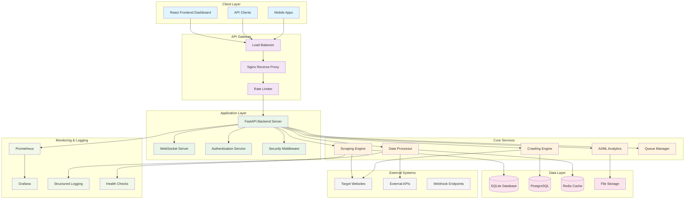
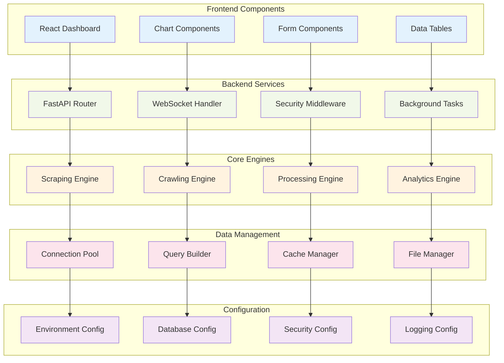
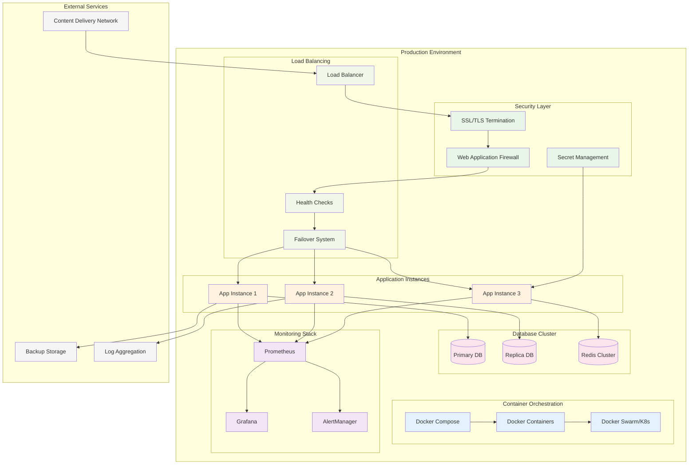
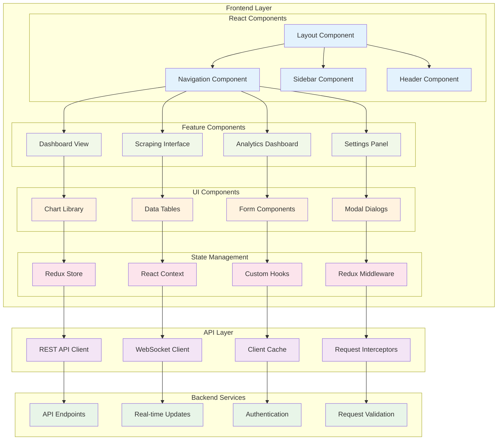
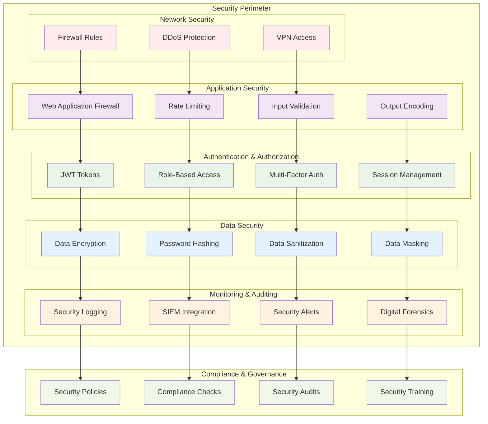

# System Architecture Diagrams

## 🏗️ High-Level System Architecture

## 🔄 Data Flow Architecture

```mermaid

graph LR
    subgraph "Input Sources"
        USER[User Interface]
        API_REQ[API Requests]
        SCHEDULER[Scheduled Jobs]
    end

    subgraph "Request Processing"
        VALIDATION[Input Validation]
        AUTH_CHECK[Authentication]
        RATE_LIMIT[Rate Limiting]
        QUEUE_MGR[Queue Manager]
    end

    subgraph "Data Collection"
        CRAWLER[Web Crawler]
        SCRAPER[Data Scraper]
        EXTRACTOR[Content Extractor]
    end

    subgraph "Data Processing"
        CLEANER[Data Cleaner]
        NORMALIZER[Data Normalizer]
        ENRICHER[Data Enricher]
        VALIDATOR[Data Validator]
    end

    subgraph "AI/ML Pipeline"
        ANALYZER[Content Analyzer]
        CLASSIFIER[Content Classifier]
        PREDICTOR[Trend Predictor]
        INSIGHTS[Insight Generator]
    end

    subgraph "Storage Layer"
        CACHE[Redis Cache]
        DATABASE[SQLite/PostgreSQL]
        FILES[File Storage]
        ARCHIVE[Archive Storage]
    end

    subgraph "Output Layer"
        DASHBOARD[Real-time Dashboard]
        REPORTS[Generated Reports]
        ALERTS[Smart Alerts]
        EXPORTS[Data Exports]
    end

    %% Flow connections
    USER --> VALIDATION
    API_REQ --> VALIDATION
    SCHEDULER --> VALIDATION

    VALIDATION --> AUTH_CHECK
    AUTH_CHECK --> RATE_LIMIT
    RATE_LIMIT --> QUEUE_MGR

    QUEUE_MGR --> CRAWLER
    QUEUE_MGR --> SCRAPER

    CRAWLER --> EXTRACTOR
    SCRAPER --> EXTRACTOR
    EXTRACTOR --> CLEANER

    CLEANER --> NORMALIZER
    NORMALIZER --> ENRICHER
    ENRICHER --> VALIDATOR

    VALIDATOR --> CACHE
    VALIDATOR --> DATABASE
    VALIDATOR --> ANALYZER

    ANALYZER --> CLASSIFIER
    CLASSIFIER --> PREDICTOR
    PREDICTOR --> INSIGHTS

    DATABASE --> DASHBOARD
    INSIGHTS --> DASHBOARD
    CACHE --> DASHBOARD

    DATABASE --> REPORTS
    INSIGHTS --> ALERTS
    DATABASE --> EXPORTS

    %% Styling
    classDef input fill:#e3f2fd
    classDef processing fill:#f1f8e9
    classDef collection fill:#fff3e0
    classDef dataProc fill:#fce4ec
    classDef ai fill:#f3e5f5
    classDef storage fill:#e8f5e8
    classDef output fill:#e1f5fe

    class USER,API_REQ,SCHEDULER input
    class VALIDATION,AUTH_CHECK,RATE_LIMIT,QUEUE_MGR processing
    class CRAWLER,SCRAPER,EXTRACTOR collection
    class CLEANER,NORMALIZER,ENRICHER,VALIDATOR dataProc
    class ANALYZER,CLASSIFIER,PREDICTOR,INSIGHTS ai
    class CACHE,DATABASE,FILES,ARCHIVE storage
    class DASHBOARD,REPORTS,ALERTS,EXPORTS output

```

## 🔧 Component Interaction Diagram

## 🚀 Deployment Architecture

## 📱 User Interface Architecture

## 🔐 Security Architecture

